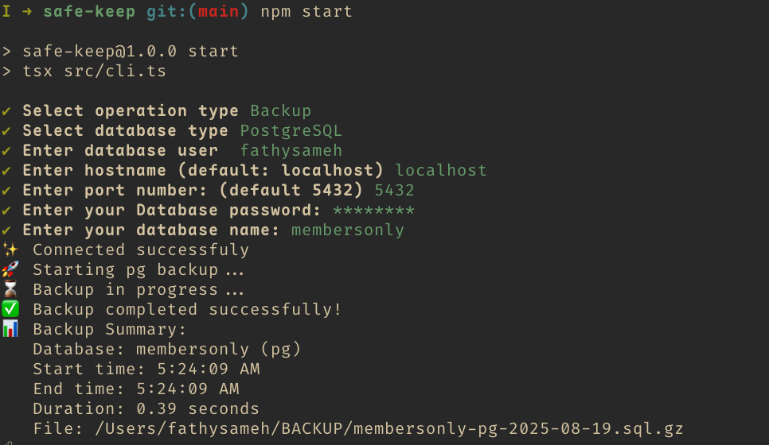
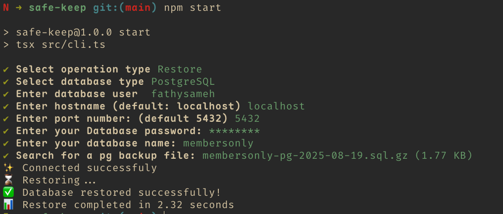

## Safe Keep

A simple, reliable CLI to back up and restore relational databases. It guides you through an interactive prompt, runs the appropriate native tools, compresses dumps on the fly, and stores them locally under `~/BACKUP/`.

### Features

- **Interactive CLI**: Guided prompts for connection details and operation selection
- **PostgreSQL & MySQL**: Uses `pg_dump/psql` and `mysqldump/mysql`
- **Compressed backups**: Streams to `.sql.gz` to save space
- **Safe defaults**: Standard naming and local `~/BACKUP` destination
- **Version checks**: Validates client vs server version compatibility

### Example

- **Backup**

  

- **Restore**

  

### Status

- Supported: **PostgreSQL**, **MySQL** (full database backup/restore)
- Planned: **SQLite**, **MongoDB**

---

### Requirements

- Node.js 18+
- CLI tools on PATH:
  - PostgreSQL: `pg_dump`, `psql`
  - MySQL: `mysqldump`, `mysql`

> On macOS with Homebrew: `brew install postgresql mysql-client` (then ensure their bin directories are on PATH).

---

### Install

```bash
git clone https://github.com/gazzaar/safe-keep.git
cd safe-keep
npm install
```

### Run

```bash
npm start
# or
npx tsx src/cli.ts
```

You will be prompted to choose between Backup or Restore, then provide database connection details.

---

### Usage

- **Backup**:

  1. Choose "Backup"
  2. Pick a database type (PostgreSQL/MySQL)
  3. Provide connection details
  4. The tool creates a compressed dump at `~/BACKUP/<dbName>-<dbType>-YYYY-MM-DD.sql.gz`

- **Restore**:
  1. Choose "Restore"
  2. Provide connection details for the target server
  3. Select an existing `*.sql.gz` under `~/BACKUP` that matches the DB type
  4. The tool creates the database (if needed) and streams the decompressed SQL into it

---

### Backup file naming

```
<dbName>-<dbType>-YYYY-MM-DD.sql.gz
```

Examples:

- `inventory-pg-2025-01-31.sql.gz`
- `crm-MySql-2025-01-31.sql.gz`

Backups are stored under `~/BACKUP/` by default. The directory is created if it does not exist.

---

### Project structure

```text
src/
  cli.ts                          # Interactive entrypoint
  types.ts                        # Shared types
  databases/
    handleDBType.ts               # Routes to DB-specific connectors
    postgresql/pgConnect.ts       # PG connect + version checks + op orchestration
    mysql/mysqlConnect.ts         # MySQL connect + version checks + op orchestration
  util/
    backupStreams.ts              # Streaming dump + gzip to file
    restoreStreams.ts             # Streaming gunzip from file to client
    getFileOptions.ts             # Backup path + filename helpers
    formatFileSize.ts             # Human-readable sizes for UI
    extractDBType.ts              # Parse db type from backup filename
    getVersions.ts                # Version parsing + compatibility checks
```

---

### Security notes

- Passwords are provided at runtime via prompt. For PostgreSQL, `PGPASSWORD` is set in the child process environment; for MySQL, `--password` is passed to the client.
- Backups are plain SQL inside Gzip archives. No encryption is currently applied.

---

### Roadmap / TODO

- Cloud storage integrations

  - S3-compatible (AWS S3, MinIO), GCS, Azure Blob
  - Pluggable storage drivers with a simple interface
  - Configurable retention and lifecycle policies

- Encryption

  - At-rest encryption using AES-256 (Node `crypto` or `age`/`gpg`)
  - Optional KMS-backed key management (AWS KMS, GCP KMS)
  - Integrity checks (hash/signature) per artifact

- Specific backup/restore operations

  - Subset selection: tables, schemas, routines
  - Include/exclude patterns
  - Pre/post hooks (e.g., lock tables, set roles)
  - Incremental or logical replication-based strategies (where supported)

- Other
  - SQLite & MongoDB support
  - Non-interactive mode via flags/env (CI-friendly)
  - Rich progress + logging levels
  - Scheduling examples (cron/systemd) and recipes

---

### Contributing

Issues and PRs are welcome. Please run the project locally and keep changes small and focused.

### License

MIT. See `LICENSE`.
